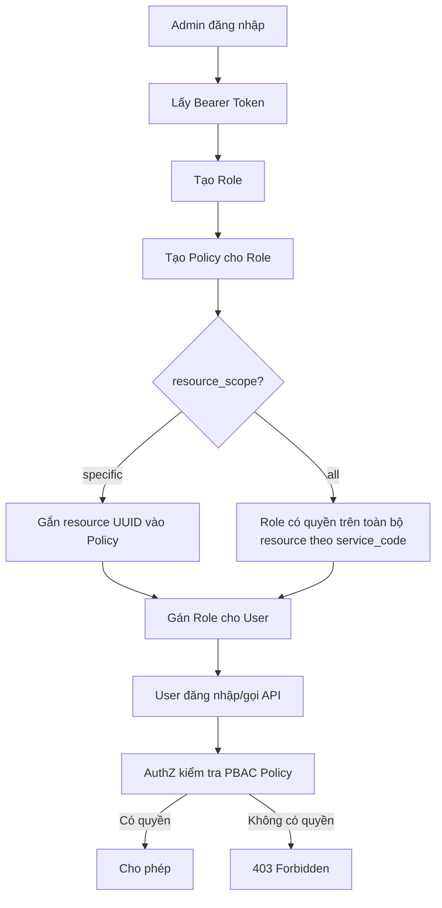

# SPEC – Tính năng Quản lý Vai trò & Phân quyền PBAC/RBAC

**Version:** Draft v0.2
**Mục tiêu sử dụng:** Làm đầu vào cho dự án automation test API + UI
**Phạm vi:** Role Management, Policy Management, Resource Policy Mapping, Permission Discovery Tree, UI Role Management
**Chiến lược test:** API-first, UI-after

---

## 1. Mục tiêu tính năng

Tính năng **Quản lý vai trò** cho phép admin:

* Tạo, xem, sửa, xóa vai trò người dùng.
* Gán vai trò cho user.
* Cấu hình chính sách phân quyền chi tiết theo PBAC.
* Gắn quyền theo service/resource/action.
* Kiểm tra cây quyền của user đang đăng nhập.
* Đảm bảo UI hiển thị đúng menu, nút thao tác và quyền theo role/policy.

Hệ thống ưu tiên mô hình **PBAC-first**:

1. Admin tạo Role với `name`, `description`, `status`.
2. Admin tạo PBAC Policy cho Role.
3. Admin gắn resource cụ thể vào Policy nếu `resource_scope = specific`.
4. Admin gán Role cho User.
5. User đăng nhập/gọi API.
6. Hệ thống kiểm tra quyền theo token và PBAC Policy.

---

## 2. Actor / Đối tượng sử dụng

| Actor          | Mô tả                                | Quyền kỳ vọng                                                                                  |
| -------------- | ------------------------------------ | ---------------------------------------------------------------------------------------------- |
| ROOT           | Tài khoản đặc quyền cao nhất         | Có toàn quyền, bao gồm đổi role của System Admin                                               |
| System Admin   | Admin hệ thống thông thường          | Quản lý role/policy theo quyền được cấp, nhưng không được đổi role ROOT hoặc System Admin khác |
| Role Admin     | Người được cấp quyền quản lý vai trò | Có thể tạo/xem/sửa/xóa/gán role nếu có quyền tương ứng                                         |
| User thường    | Người dùng được gán role             | Chỉ truy cập chức năng/resource được policy cho phép                                           |
| Automation Bot | Tài khoản test automation            | Dùng token để chạy API/UI test theo ma trận quyền                                              |

---

## 3. Phạm vi chức năng

### 3.1 Trong phạm vi

* Tạo vai trò.
* Xem danh sách vai trò.
* Tìm kiếm, phân trang danh sách vai trò.
* Cập nhật tên, mô tả, trạng thái vai trò.
* Xóa vai trò.
* Gán vai trò cho user.
* Tạo, xem, sửa, xóa PBAC Policy.
* Gắn resource UUID vào policy.
* Gỡ resource UUID khỏi policy.
* Gắn/gỡ resource hàng loạt.
* Lấy cây phân quyền của user đang đăng nhập.
* Kiểm tra quyền theo action bitmask:

  * `read = 1`
  * `write = 2`
  * `execute = 4`
  * `all = 7`
* Kiểm tra rule bảo vệ ROOT/System Admin.
* Automation API cho toàn bộ luồng chính.
* Automation UI cho các luồng chính trên màn hình quản lý vai trò.

### 3.2 Ngoài phạm vi bản SPEC này

* Đăng nhập/refresh token, trừ phần chuẩn bị token test.
* Quản lý user chi tiết.
* CRUD resource thực tế như tòa nhà, căn hộ, thiết bị.
* Thiết kế UI chi tiết pixel-level.
* Migration dữ liệu role cũ.
* RBAC legacy qua trường `permissions`, ngoại trừ testcase kiểm tra backward compatibility/cảnh báo overwrite.

---

## 4. Thuật ngữ

| Thuật ngữ       | Ý nghĩa                                                    |
| --------------- | ---------------------------------------------------------- |
| Role            | Vai trò được gán cho user                                  |
| Policy          | Chính sách phân quyền gắn với role                         |
| PBAC            | Policy-Based Access Control                                |
| RBAC Legacy     | Cơ chế quyền cũ qua trường `permissions`                   |
| Resource        | Đối tượng được phân quyền, ví dụ building/apartment/device |
| Resource Scope  | `all` hoặc `specific`                                      |
| Action Bitmask  | Số nguyên biểu diễn quyền thao tác                         |
| Effect          | `allow` hoặc `deny`                                        |
| Permission Tree | Cây quyền trả về cho client/UI                             |

---

## 5. Luồng nghiệp vụ chính

### 5.1 Luồng tạo role và phân quyền chuẩn PBAC



### 5.2 Luồng gán role

1. Admin chọn Role cần gán.
2. Admin chọn User mục tiêu.
3. Hệ thống kiểm tra user mục tiêu:

   * Nếu là ROOT: chặn.
   * Nếu là System Admin: chỉ ROOT được phép đổi.
   * Nếu là user thường: cho phép nếu admin có `RoleManagement:update`.
4. Nếu user đã có role cũ, role mới sẽ ghi đè role cũ.
5. Hệ thống tạo assignment mới, role cũ được revoke hoặc đánh dấu hết hiệu lực tùy thiết kế backend.

### 5.3 Luồng lấy cây quyền

1. User đăng nhập.
2. Client gọi `GET /api/v0/permissions/tree`.
3. Backend tính toán cây quyền dựa trên PBAC Policy của role hiện tại.
4. Node cha có `actions = 0`.
5. Node lá/service có `actions > 0` nếu user có quyền.
6. UI chỉ hiển thị parent node nếu bên dưới có ít nhất một child node có quyền.

---

## 6. API Contract tóm tắt cho automation

### 6.1 Role Management

| ID          | API                                 | Method | Permission yêu cầu      | Mục đích           |
| ----------- | ----------------------------------- | ------ | ----------------------- | ------------------ |
| ROLE-API-01 | `/api/v0/roles/`                    | POST   | `RoleManagement:create` | Tạo role           |
| ROLE-API-02 | `/api/v0/roles/`                    | GET    | `RoleManagement:view`   | Lấy danh sách role |
| ROLE-API-03 | `/api/v0/roles/:roleId`             | PATCH  | `RoleManagement:update` | Cập nhật role      |
| ROLE-API-04 | `/api/v0/roles/:roleId`             | DELETE | `RoleManagement:delete` | Xóa role           |
| ROLE-API-05 | `/api/v0/roles/:roleId/assignments` | POST   | `RoleManagement:update` | Gán role cho user  |

### 6.2 Policy Management

| ID            | API                                                       | Method | Permission yêu cầu      | Mục đích             |
| ------------- | --------------------------------------------------------- | ------ | ----------------------- | -------------------- |
| POLICY-API-01 | `/api/v0/auth/policies/`                                  | POST   | `RoleManagement:create` | Tạo policy           |
| POLICY-API-02 | `/api/v0/auth/policies/?role_id=<uuid>`                   | GET    | `RoleManagement:view`   | Lấy policy theo role |
| POLICY-API-03 | `/api/v0/auth/policies/:id`                               | PATCH  | `RoleManagement:update` | Sửa policy           |
| POLICY-API-04 | `/api/v0/auth/policies/:id`                               | DELETE | `RoleManagement:delete` | Xóa policy           |
| POLICY-API-05 | `/api/v0/auth/policies/:id/resources`                     | POST   | `RoleManagement:update` | Gắn 1 resource       |
| POLICY-API-06 | `/api/v0/auth/policies/:policy_id/resources/:resource_id` | DELETE | `RoleManagement:update` | Gỡ 1 resource        |
| POLICY-API-07 | `/api/v0/auth/policies/:id/resources/bulk`                | POST   | `RoleManagement:update` | Gắn nhiều resource   |
| POLICY-API-08 | `/api/v0/auth/policies/:id/resources/bulk`                | DELETE | `RoleManagement:update` | Gỡ nhiều resource    |

### 6.3 Permission Discovery

| ID          | API                        | Method | Permission yêu cầu | Mục đích                              |
| ----------- | -------------------------- | ------ | ------------------ | ------------------------------------- |
| PERM-API-01 | `/api/v0/permissions/tree` | GET    | Token hợp lệ       | Lấy cây phân quyền của user đăng nhập |

---

## 7. Quy tắc dữ liệu & validation

### 7.1 Role

| Trường               | Rule                                                                          |
| -------------------- | ----------------------------------------------------------------------------- |
| `name`               | Bắt buộc, duy nhất toàn hệ thống, không phân biệt hoa/thường                  |
| `name length`        | Tối đa 100 ký tự                                                              |
| `name ký tự`         | Không chứa ký tự đặc biệt                                                     |
| `description`        | Không bắt buộc                                                                |
| `description length` | Tối đa 500 ký tự                                                              |
| `status`             | `Active` hoặc `Disabled`; nếu không truyền mặc định `Active`                  |
| `permissions`        | Legacy, client mới không dùng; nếu truyền có thể overwrite PBAC Policy cơ bản |

### 7.2 Policy

| Trường           | Rule                                                     |
| ---------------- | -------------------------------------------------------- |
| `role_id`        | Bắt buộc, phải là UUID role tồn tại                      |
| `service_code`   | Bắt buộc, phải thuộc danh sách service hợp lệ            |
| `resource_scope` | `all` hoặc `specific`                                    |
| `actions`        | int32, bitmask hợp lệ: `1`, `2`, `3`, `4`, `5`, `6`, `7` |
| `effect`         | `allow` hoặc `deny`                                      |
| `resources`      | Chỉ có ý nghĩa khi `resource_scope = specific`           |

### 7.3 Resource mapping

| Trường                 | Rule                                                         |
| ---------------------- | ------------------------------------------------------------ |
| `resource_id`          | Bắt buộc, UUID resource thực tế                              |
| `resource_ids`         | Array UUID, không rỗng                                       |
| Duplicate resource     | Cần xác định: bỏ qua, báo lỗi, hay idempotent                |
| Resource không tồn tại | Cần xác định: báo `NOT_FOUND` hay cho phép lưu mapping trước |

---

## 8. Quy tắc phân quyền

### 8.1 Quyền gọi API quản lý

| Hành động              | Quyền cần có            |
| ---------------------- | ----------------------- |
| Tạo role               | `RoleManagement:create` |
| Xem role               | `RoleManagement:view`   |
| Sửa role               | `RoleManagement:update` |
| Xóa role               | `RoleManagement:delete` |
| Gán role               | `RoleManagement:update` |
| Tạo policy             | `RoleManagement:create` |
| Xem policy             | `RoleManagement:view`   |
| Sửa policy             | `RoleManagement:update` |
| Xóa policy             | `RoleManagement:delete` |
| Gắn/gỡ resource policy | `RoleManagement:update` |
| Lấy permission tree    | Token hợp lệ            |

### 8.2 Rule đặc quyền

| Rule                                                      | Kỳ vọng                                                     |
| --------------------------------------------------------- | ----------------------------------------------------------- |
| Không ai được đổi role của ROOT                           | Trả `403 Forbidden`                                         |
| System Admin thường không được đổi role System Admin khác | Trả `403 Forbidden`                                         |
| Chỉ ROOT được đổi role của System Admin thường            | Thành công nếu ROOT có token hợp lệ                         |
| User chỉ có 1 role hiệu lực tại một thời điểm             | Gán role mới sẽ thay role cũ                                |
| Role đã từng được gán cho user không được xóa             | Trả lỗi phù hợp, dự kiến `409 Conflict` hoặc business error |

---

## 9. User Stories & Acceptance Criteria

### US-ROLE-01 – Tạo vai trò mới

**Là** Admin có quyền quản lý role,
**Tôi muốn** tạo một vai trò mới,
**Để** có thể gán vai trò đó cho user và cấu hình quyền theo policy.

**Acceptance Criteria**

* Given Admin có token hợp lệ và có `RoleManagement:create`
* When Admin gọi tạo role với `name` hợp lệ
* Then hệ thống tạo role thành công
* And response có `id`, `name`, `description`, `status`, `is_system_admin`, `permissions`, `user_count`
* And `status` mặc định là `Active` nếu request không truyền status

**Negative AC**

* Tạo role thiếu `name` phải lỗi validation.
* Tạo role trùng tên khác hoa/thường phải lỗi duplicate.
* Tạo role name > 100 ký tự phải lỗi validation.
* Tạo role description > 500 ký tự phải lỗi validation.
* User không có `RoleManagement:create` phải bị `403`.

---

### US-ROLE-02 – Xem danh sách vai trò

**Là** Admin có quyền xem role,
**Tôi muốn** xem danh sách vai trò, tìm kiếm và phân trang,
**Để** quản lý các vai trò hiện có.

**Acceptance Criteria**

* Given Admin có `RoleManagement:view`
* When gọi `GET /api/v0/roles`
* Then hệ thống trả về `items`, `total`, `page`, `limit`
* And mỗi item có format Role Object
* And search theo tên hoạt động đúng
* And limit mặc định là 20 nếu không truyền

**Negative AC**

* Token thiếu hoặc sai phải bị `401`.
* User không có quyền view phải bị `403`.
* `page`, `limit` sai kiểu hoặc âm phải lỗi validation.

---

### US-ROLE-03 – Cập nhật vai trò

**Là** Admin có quyền sửa role,
**Tôi muốn** cập nhật tên, mô tả hoặc trạng thái role,
**Để** chỉnh sửa role theo thay đổi vận hành.

**Acceptance Criteria**

* Given role tồn tại
* And Admin có `RoleManagement:update`
* When Admin patch một hoặc nhiều trường hợp lệ
* Then response trả về Role Object đã cập nhật
* And các field không truyền giữ nguyên giá trị cũ

**Negative AC**

* Update roleId không tồn tại phải trả `NOT_FOUND`.
* Update `name` trùng role khác phải lỗi duplicate.
* Update status ngoài `Active/Disabled` phải lỗi validation.
* User không có quyền update phải bị `403`.

---

### US-ROLE-04 – Xóa vai trò

**Là** Admin có quyền xóa role,
**Tôi muốn** xóa role chưa từng sử dụng,
**Để** dọn dữ liệu role sai hoặc không còn cần dùng.

**Acceptance Criteria**

* Given role chưa từng được assign cho user
* And Admin có `RoleManagement:delete`
* When Admin xóa role
* Then hệ thống xóa thành công
* And role không còn xuất hiện trong danh sách

**Negative AC**

* Xóa role đã từng được assign phải bị chặn.
* Xóa roleId không tồn tại phải `NOT_FOUND`.
* User không có quyền delete phải bị `403`.
* Xóa system role nếu có phải bị chặn.

---

### US-ROLE-05 – Gán role cho user

**Là** Admin có quyền update role,
**Tôi muốn** gán role cho user,
**Để** user có quyền tương ứng.

**Acceptance Criteria**

* Given role tồn tại
* And user tồn tại
* And Admin có `RoleManagement:update`
* When Admin gán role cho user
* Then hệ thống tạo assignment thành công
* And user chỉ còn 1 role hiệu lực
* And response có `id`, `userId`, `roleId`, `assigned_at`, `revoked_at`

**Negative AC**

* Gán role cho ROOT phải bị `403`.
* Admin thường gán/đổi role của System Admin phải bị `403`.
* Chỉ ROOT được đổi role của System Admin.
* Gán roleId không tồn tại phải `NOT_FOUND`.
* Gán userId không tồn tại phải `NOT_FOUND`.
* User không có quyền update phải bị `403`.

---

### US-POLICY-01 – Tạo policy cho role

**Là** Admin có quyền tạo policy,
**Tôi muốn** tạo policy cho role,
**Để** role có quyền theo service/resource/action cụ thể.

**Acceptance Criteria**

* Given role tồn tại
* And Admin có `RoleManagement:create`
* When Admin tạo policy với `role_id`, `service_code`, `resource_scope`, `actions`, `effect`
* Then policy được tạo thành công
* And response có `id`, `role_id`, `service_code`, `resource_scope`, `actions`, `effect`, `resources`

**Negative AC**

* `role_id` không tồn tại phải lỗi.
* `service_code` không hợp lệ phải lỗi.
* `resource_scope` ngoài `all/specific` phải lỗi.
* `actions` ngoài bitmask hợp lệ phải lỗi.
* `effect` ngoài `allow/deny` phải lỗi.
* User không có quyền create phải bị `403`.

---

### US-POLICY-02 – Xem policy theo role

**Là** Admin có quyền xem policy,
**Tôi muốn** xem danh sách policy của một role,
**Để** kiểm tra role đó đang có quyền gì.

**Acceptance Criteria**

* Given role tồn tại
* And Admin có `RoleManagement:view`
* When gọi list policy với `role_id`
* Then response trả về `items`, `total`, `page`, `limit`
* And các item thuộc đúng `role_id` request

**Negative AC**

* Thiếu `role_id` phải lỗi validation.
* `role_id` không tồn tại trả rỗng hoặc lỗi theo rule backend cần xác nhận.
* User không có quyền view phải bị `403`.

---

### US-POLICY-03 – Cập nhật policy

**Là** Admin có quyền sửa policy,
**Tôi muốn** sửa action/effect/scope của policy,
**Để** thay đổi quyền của role.

**Acceptance Criteria**

* Given policy tồn tại
* And Admin có `RoleManagement:update`
* When Admin patch `actions`, `effect`, hoặc `resource_scope`
* Then policy cập nhật thành công
* And quyền thực tế của user bị ảnh hưởng tương ứng sau lần kiểm tra tiếp theo

**Negative AC**

* Policy không tồn tại phải `NOT_FOUND`.
* Update actions/effect/scope không hợp lệ phải lỗi validation.
* User không có quyền update phải bị `403`.

---

### US-POLICY-04 – Xóa policy

**Là** Admin có quyền xóa policy,
**Tôi muốn** xóa policy khỏi role,
**Để** thu hồi nhóm quyền đã cấp.

**Acceptance Criteria**

* Given policy tồn tại
* And Admin có `RoleManagement:delete`
* When Admin xóa policy
* Then policy bị xóa
* And user thuộc role đó không còn quyền theo policy này

**Negative AC**

* Policy không tồn tại phải `NOT_FOUND`.
* User không có quyền delete phải bị `403`.

---

### US-POLICY-05 – Gắn một resource cụ thể vào policy

**Là** Admin có quyền update policy,
**Tôi muốn** gắn resource UUID vào policy `specific`,
**Để** role chỉ có quyền trên resource cụ thể.

**Acceptance Criteria**

* Given policy tồn tại và `resource_scope = specific`
* And Admin có `RoleManagement:update`
* When Admin add `resource_id`
* Then mapping policy-resource được tạo
* And role có quyền trên resource đó theo `actions/effect`

**Negative AC**

* Add resource cho policy `all` cần xác định cho phép hay chặn.
* Add duplicate resource cần xác định idempotent hay lỗi.
* Resource UUID sai format phải lỗi validation.
* User không có quyền update phải bị `403`.

---

### US-POLICY-06 – Gỡ một resource khỏi policy

**Là** Admin có quyền update policy,
**Tôi muốn** gỡ resource UUID khỏi policy,
**Để** thu hồi quyền trên resource đó.

**Acceptance Criteria**

* Given mapping policy-resource tồn tại
* When Admin gọi remove resource
* Then mapping bị xóa
* And user không còn quyền do mapping đó tạo ra

**Negative AC**

* Mapping không tồn tại trả success idempotent hay `NOT_FOUND` cần xác nhận.
* User không có quyền update phải bị `403`.

---

### US-POLICY-07 – Gắn/gỡ resource hàng loạt

**Là** Admin có quyền update policy,
**Tôi muốn** gắn hoặc gỡ nhiều resource trong một request,
**Để** phân quyền nhiều khu vực nhanh và nhất quán.

**Acceptance Criteria**

* Given policy tồn tại
* And request có danh sách UUID hợp lệ
* When bulk add/remove
* Then toàn bộ thao tác chạy trong cùng transaction
* And response phản ánh danh sách resource đã xử lý

**Negative AC**

* Nếu một resource lỗi trong batch, cần xác định rollback toàn bộ hay partial success.
* Danh sách rỗng phải lỗi validation.
* Có duplicate trong danh sách cần xác định xử lý.
* User không có quyền update phải bị `403`.

---

### US-PERM-01 – Lấy cây quyền của user

**Là** User đã đăng nhập,
**Tôi muốn** lấy cây quyền của mình,
**Để** UI biết chức năng nào được hiển thị/thao tác.

**Acceptance Criteria**

* Given user có token hợp lệ
* When gọi `GET /api/v0/permissions/tree`
* Then hệ thống trả về cây module/service
* And node cha có `actions = 0`
* And node lá có bitmask theo quyền user
* And UI có thể ẩn parent node nếu toàn bộ child không có quyền

**Negative AC**

* Không có token hoặc token sai phải `401`.
* User disabled/role disabled cần xác định response.
* User không có quyền nào thì trả cây rỗng hay cây với actions = 0 cần xác nhận.

---

### US-AUTHZ-01 – Kiểm tra quyền thực tế theo policy

**Là** hệ thống,
**Tôi muốn** kiểm tra quyền từ PBAC Policy khi user gọi API nghiệp vụ,
**Để** đảm bảo user chỉ thao tác đúng resource/action được cấp.

**Acceptance Criteria**

* User có allow `read` trên resource A thì đọc resource A thành công.
* User không có allow `read` trên resource B thì đọc resource B bị `403`.
* User chỉ có `read` thì thao tác `write/execute` bị `403`.
* User có scope `all` thì có quyền trên mọi resource thuộc service tương ứng.
* User có scope `specific` thì chỉ có quyền trên resource được mapping.

**Negative AC**

* Conflict allow/deny cần rule rõ: deny thắng hay policy mới nhất thắng.
* Conflict all/specific cần rule rõ.

---

## 10. UI Automation Scope

UI nằm trong scope automation, nhưng triển khai sau khi API automation ổn định.

### 10.1 Mục tiêu UI automation

* Đảm bảo màn hình quản lý vai trò hiển thị đúng dữ liệu từ API.
* Đảm bảo form tạo/sửa role validate đúng.
* Đảm bảo thao tác gán role cho user hoạt động đúng.
* Đảm bảo cấu hình policy/resource trên UI đúng với API.
* Đảm bảo user không đủ quyền không thấy menu/nút hoặc thao tác bị chặn.
* Đảm bảo permission tree ảnh hưởng đúng tới UI.

### 10.2 UI case cần test

| TC ID        | Màn hình          | Mục tiêu                                                 | Priority |
| ------------ | ----------------- | -------------------------------------------------------- | -------- |
| TC-UI-RM-001 | Danh sách role    | Hiển thị role, search, pagination                        | P0       |
| TC-UI-RM-002 | Tạo role          | Form validation name/description/status                  | P0       |
| TC-UI-RM-003 | Sửa role          | Edit và lưu thành công                                   | P0       |
| TC-UI-RM-004 | Xóa role          | Confirm delete, chặn role đã assign                      | P0       |
| TC-UI-RM-005 | Gán role          | Chọn user, chọn role, lưu                                | P0       |
| TC-UI-RM-006 | Policy            | Tạo policy all/specific                                  | P0       |
| TC-UI-RM-007 | Policy Resource   | Add/remove resource                                      | P0       |
| TC-UI-RM-008 | Permission Tree   | UI hiển thị node cha/con đúng theo actions               | P0       |
| TC-UI-RM-009 | Permission Denied | User không đủ quyền không thấy nút hoặc thao tác bị chặn | P0       |
| TC-UI-RM-010 | Privilege Guard   | Không cho thao tác ROOT/System Admin trái quyền          | P0       |
| TC-UI-RM-011 | Error Handling    | API lỗi thì UI hiển thị message phù hợp                  | P1       |

---

## 11. Ma trận testcase automation đề xuất

### 11.1 API P0 – Bắt buộc có

| TC ID        | Nhóm                 | Mục tiêu                           | Kỳ vọng                      |
| ------------ | -------------------- | ---------------------------------- | ---------------------------- |
| TC-RM-001    | Role Create          | Tạo role hợp lệ                    | 200, có Role Object          |
| TC-RM-002    | Role Create          | Tạo role thiếu name                | 400 validation               |
| TC-RM-003    | Role Create          | Tạo role trùng tên khác hoa/thường | Duplicate error              |
| TC-RM-004    | Role List            | List role mặc định                 | 200, page=1, limit=20        |
| TC-RM-005    | Role List            | Search theo tên                    | Chỉ trả role phù hợp         |
| TC-RM-006    | Role Update          | Update description/status          | 200, data mới                |
| TC-RM-007    | Role Delete          | Xóa role chưa assign               | 200, role biến mất           |
| TC-RM-008    | Role Delete          | Xóa role đã từng assign            | Bị chặn                      |
| TC-RM-009    | Assign Role          | Gán role cho user thường           | 200, assignment đúng         |
| TC-RM-010    | Assign Role          | Gán role mới đè role cũ            | User chỉ có 1 role hiệu lực  |
| TC-RM-011    | Privilege            | Đổi role ROOT                      | 403                          |
| TC-RM-012    | Privilege            | Admin thường đổi role System Admin | 403                          |
| TC-RM-013    | Privilege            | ROOT đổi role System Admin         | 200                          |
| TC-PM-001    | Policy Create        | Tạo allow read+write scope all     | 200, actions=3               |
| TC-PM-002    | Policy Create        | Tạo policy scope specific          | 200                          |
| TC-PM-003    | Policy List          | List policy theo role_id           | 200, đúng role               |
| TC-PM-004    | Policy Update        | Hạ quyền từ 7 xuống 1              | 200, actions=1               |
| TC-PM-005    | Policy Delete        | Xóa policy                         | 200, policy không còn        |
| TC-PM-006    | Resource Add         | Add resource vào policy specific   | 200, mapping đúng            |
| TC-PM-007    | Resource Remove      | Remove resource                    | 200, quyền bị thu hồi        |
| TC-PM-008    | Resource Bulk Add    | Add nhiều resource                 | 200, transaction thành công  |
| TC-PM-009    | Resource Bulk Remove | Remove nhiều resource              | 200                          |
| TC-PT-001    | Permission Tree      | User có quyền đọc tree             | 200, node lá có actions đúng |
| TC-AUTHZ-001 | AuthZ                | User có quyền resource A           | API nghiệp vụ thành công     |
| TC-AUTHZ-002 | AuthZ                | User không có quyền resource B     | 403                          |
| TC-AUTHZ-003 | AuthZ                | User chỉ read nhưng gọi write      | 403                          |

### 11.2 API P1 – Nên có

| TC ID      | Nhóm            | Mục tiêu                            | Kỳ vọng                                      |
| ---------- | --------------- | ----------------------------------- | -------------------------------------------- |
| TC-RM-014  | Validation      | name > 100 ký tự                    | 400                                          |
| TC-RM-015  | Validation      | name có ký tự đặc biệt              | 400                                          |
| TC-RM-016  | Validation      | description > 500 ký tự             | 400                                          |
| TC-RM-017  | Pagination      | limit=0                             | Trả tối đa theo thiết kế                     |
| TC-RM-018  | Pagination      | limit > 100                         | Bị cap hoặc validation                       |
| TC-PM-010  | Validation      | actions=0                           | Cần xác nhận hợp lệ hay lỗi                  |
| TC-PM-011  | Validation      | actions=8                           | 400                                          |
| TC-PM-012  | Validation      | effect sai enum                     | 400                                          |
| TC-PM-013  | Validation      | resource_scope sai enum             | 400                                          |
| TC-PM-014  | Conflict        | allow và deny cùng service/resource | Theo rule cần xác nhận                       |
| TC-PM-015  | Resource        | Add duplicate resource              | Theo rule cần xác nhận                       |
| TC-PM-016  | Resource        | Bulk có 1 UUID sai                  | Rollback hoặc partial theo rule cần xác nhận |
| TC-PT-002  | Permission Tree | Role disabled                       | Cần xác nhận tree rỗng/403                   |
| TC-SEC-001 | Security        | Không truyền token                  | 401                                          |
| TC-SEC-002 | Security        | Token hết hạn                       | 401                                          |
| TC-SEC-003 | Security        | Token user thiếu quyền              | 403                                          |

---

## 12. Test data cần chuẩn bị

### 12.1 Users

| User               | Loại                         | Mục đích                                    |
| ------------------ | ---------------------------- | ------------------------------------------- |
| root_user          | ROOT                         | Test đặc quyền cao nhất                     |
| sys_admin_1        | System Admin                 | Test rule chỉ ROOT được đổi role            |
| sys_admin_2        | System Admin                 | Test admin thường không đổi role admin khác |
| role_admin         | Admin có RoleManagement CRUD | Test CRUD role/policy                       |
| viewer_admin       | Chỉ có view                  | Test 403 khi create/update/delete           |
| normal_user_1      | User thường                  | Test gán role và authz                      |
| normal_user_2      | User thường                  | Test đổi role, policy khác nhau             |
| no_permission_user | User không có quyền          | Test permission denied                      |

### 12.2 Roles

| Role                              | Mục đích            |
| --------------------------------- | ------------------- |
| automation_role_full              | Full actions = 7    |
| automation_role_readonly          | Read only = 1       |
| automation_role_write             | Write = 2           |
| automation_role_execute           | Execute = 4         |
| automation_role_specific_resource | Scope specific      |
| automation_role_disabled          | Test role disabled  |
| automation_role_delete_unused     | Test xóa thành công |
| automation_role_delete_used       | Test xóa bị chặn    |

### 12.3 Resources

| Resource              | Mục đích                      |
| --------------------- | ----------------------------- |
| building_A            | Resource được allow           |
| building_B            | Resource không được allow     |
| apartment_A1          | Resource con nếu có hierarchy |
| device_A1_01          | Resource thiết bị nếu có      |
| invalid_uuid          | Test validation               |
| deleted_resource_uuid | Test resource không tồn tại   |

---

## 13. Checklist automation framework

* Có cơ chế login lấy token theo từng loại user.
* Có helper tạo role và cleanup sau test.
* Có helper tạo policy và cleanup sau test.
* Có helper gắn/gỡ resource.
* Có helper assert permission tree theo node code/action.
* Có helper assert 401/403/404/409/validation error.
* Có test isolation: mỗi testcase tạo dữ liệu riêng hoặc dùng prefix `auto_yyyyMMdd_HHmmss`.
* Có cleanup an toàn: không xóa role đã từng assign nếu backend chặn; dùng role riêng cho mỗi run.
* Có tagging test: `p0`, `p1`, `api`, `ui`, `security`, `pbac`, `privilege`.
* Có báo cáo mapping testcase ↔ user story ↔ API.

---

## 14. Rule cần thống nhất trước khi automation

Các điểm dưới đây chưa đủ rõ, cần Product/Backend xác nhận trước khi khóa testcase:

1. Danh sách `service_code` hợp lệ là gì? Ví dụ `bms`, `iot`, `parking` hay còn code khác?
2. Resource hierarchy cụ thể là gì? Building → Floor → Room → Device hay Building → Apartment → Device?
3. `resource_scope = all` áp dụng trên toàn bộ service hay toàn bộ tenant/project?
4. Khi có policy `allow` và `deny` cùng match một resource/action, rule nào thắng?
5. Khi có policy `all` và `specific` cùng match, rule merge quyền thế nào?
6. `actions = 0` có được phép tạo policy không, hay chỉ dùng cho parent node permission tree?
7. Role `Disabled` ảnh hưởng thế nào?

   * User còn đăng nhập được không?
   * Permission tree trả rỗng hay 403?
   * API nghiệp vụ bị 403 toàn bộ hay chỉ không nhận policy?
8. Xóa role đã từng assign trả HTTP status nào? `400`, `403`, `409` hay business error 200 + error?
9. Xóa policy có tự xóa resource mapping liên quan không?
10. Add duplicate resource vào policy xử lý idempotent hay báo lỗi?
11. Bulk add/remove nếu một phần tử lỗi thì rollback toàn bộ hay partial success?
12. Resource không tồn tại khi add policy thì báo lỗi hay vẫn lưu UUID?
13. Permission tree có trả toàn bộ cây với actions=0 hay chỉ trả node có quyền?
14. Parent node có cần ẩn ở backend hay frontend tự xử lý?
15. Có audit log cho tạo/sửa/xóa/gán role/policy không?
16. Có cần lưu lịch sử assignment cũ với `revoked_at` không?
17. Có giới hạn số lượng policy/resource mapping trên mỗi role không?
18. Tên role cho phép underscore/dash/space/tiếng Việt không?
19. Response lỗi chuẩn là gì? Format `error.code`, `error.message`, `details` ra sao?
20. Có multi-tenant/project/org không? Role unique toàn hệ thống hay unique theo tenant?
21. Có role hệ thống không được sửa/xóa ngoài ROOT không?
22. Trường legacy `permissions` có cần test sâu không, hay chỉ test không dùng?
23. UI có cần ngăn thao tác từ frontend hay chỉ backend chặn là đủ?
24. Có cache permission không? Sau khi update policy, quyền user đổi ngay hay cần logout/login?
25. Token đã cấp trước khi đổi role có bị ảnh hưởng ngay không?

---

## 15. Definition of Done

Tính năng được coi là đạt khi:

* API Role CRUD chạy đúng happy path và negative path.
* API Policy CRUD chạy đúng happy path và negative path.
* Gán role đảm bảo user chỉ có một role hiệu lực.
* Bảo vệ ROOT/System Admin đúng rule.
* Permission tree phản ánh đúng policy.
* AuthZ nghiệp vụ theo PBAC hoạt động đúng với `all/specific`, `read/write/execute`.
* UI hiển thị đúng menu/nút/chức năng theo permission tree.
* UI form validate đúng.
* UI xử lý lỗi API rõ ràng.
* Các lỗi validation/401/403/404/409 được chuẩn hóa.
* Automation P0 chạy ổn định trên môi trường test/staging.
* Có test data riêng cho automation, không phụ thuộc dữ liệu thật.
* Có báo cáo testcase pass/fail và log request/response khi fail.

---

## 16. Rủi ro cần lưu ý

| Rủi ro                              | Tác động                                           | Giảm thiểu                                                        |
| ----------------------------------- | -------------------------------------------------- | ----------------------------------------------------------------- |
| Rule allow/deny chưa rõ             | Testcase authz có thể sai expectation              | Chốt rule trước khi viết test                                     |
| Role đã assign không xóa được       | Cleanup automation bị fail                         | Dùng prefix role riêng và cleanup bằng disable nếu không xóa được |
| Permission cache                    | Test vừa update policy đã assert ngay có thể flaky | Thêm cơ chế refresh token/cache hoặc wait/retry có giới hạn       |
| Legacy `permissions` overwrite PBAC | Policy thủ công bị mất                             | Không dùng trường `permissions` trong test chính                  |
| Resource thật thay đổi              | Test phụ thuộc dữ liệu môi trường                  | Tạo resource test cố định hoặc mock fixture                       |
| UI ẩn node theo frontend            | Khó assert API và UI đồng nhất                     | Tách testcase API tree và testcase UI render                      |

---

## 17. Gợi ý cấu trúc thư mục automation

```text
tests/
  api/
    role_management/
      role_create.spec.ts
      role_list.spec.ts
      role_update.spec.ts
      role_delete.spec.ts
      role_assignment.spec.ts
      policy_create.spec.ts
      policy_update.spec.ts
      policy_resource_mapping.spec.ts
      permission_tree.spec.ts
      authz_pbac.spec.ts
  ui/
    role_management/
      role_list_ui.spec.ts
      role_form_ui.spec.ts
      role_policy_ui.spec.ts
      role_assignment_ui.spec.ts
      permission_tree_ui.spec.ts
  fixtures/
    users.json
    roles.json
    resources.json
  helpers/
    auth.ts
    roleApi.ts
    policyApi.ts
    permissionAssert.ts
    cleanup.ts
```

---

## 18. Gợi ý naming convention cho dữ liệu test

| Đối tượng   | Format                                                     |
| ----------- | ---------------------------------------------------------- |
| Role        | `auto_role_<purpose>_<timestamp>`                          |
| Policy      | Không cần name, dùng ID response                           |
| Resource    | `auto_resource_<purpose>` nếu automation tạo được resource |
| User        | `auto_user_<role_type>`                                    |
| Test run id | `YYYYMMDD_HHmmss_<shortRandom>`                            |

Ví dụ:

```text
auto_role_readonly_20260624_150102_ab12
auto_role_specific_building_20260624_150102_cd34
auto_user_normal_01
```

---

## 19. Kết luận

Bản SPEC này đủ để bắt đầu thiết kế automation ở mức API P0/P1 và UI E2E cho luồng chính.

Thứ tự triển khai khuyến nghị:

1. Viết API automation trước để khóa logic nghiệp vụ và rule phân quyền.
2. Sau khi API ổn định, viết UI automation cho luồng chính.
3. Dùng Permission Tree để assert UI hiển thị đúng menu/nút/thao tác.
4. Chốt các rule còn thiếu ở mục 14 trước khi khóa testcase expectation.

Các điểm cần bổ sung quan trọng nhất:

* Danh sách service/resource chính thức.
* Rule conflict allow/deny.
* Hành vi role disabled.
* Chuẩn response lỗi.
* Cơ chế cache/hiệu lực quyền sau khi update policy.
* Rule transaction cho bulk resource.
* Scope UI chi tiết: màn hình nào, nút nào, flow nào đã có thiết kế.
