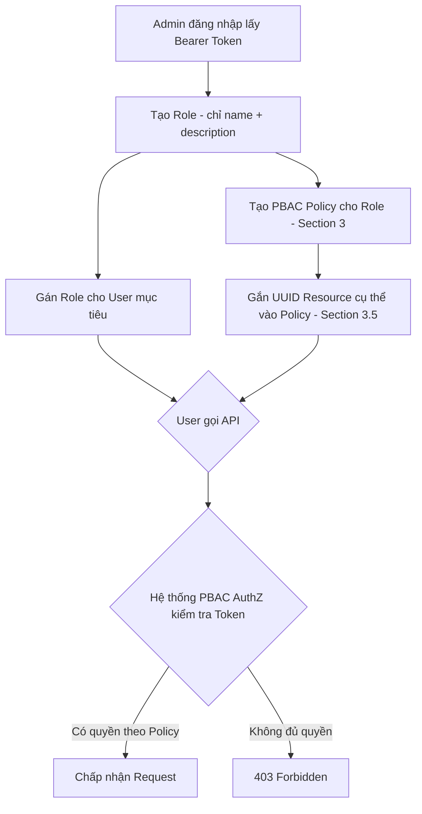

# API Quản lý Vai trò Người dùng & Chính sách (RBAC/PBAC)

Tài liệu này cung cấp đặc tả kỹ thuật toàn diện cho các endpoint thuộc nhóm **Role Management** (RBAC) và **Policy Management** (PBAC).

---

## 1. Tổng quan Luồng Phân quyền

> [!IMPORTANT]
> Hệ thống phân quyền được thiết kế **PBAC-first**. Mọi tích hợp mới nên tạo Role (chỉ cần `name`/`description`) rồi cấu hình quyền hoàn toàn qua **PBAC Policy** (Section 3).

**Luồng khuyến nghị cho client mới:**



**Yêu cầu Headers chung:**
Tất cả endpoint bên dưới đều bắt buộc truyền `Authorization: Bearer <access_token>`.

---

## 2. API Quản lý Vai trò (Roles)

**Base Path:** `/api/v0/roles`

### 2.1 Tạo Vai trò mới (Create Role)

**Method:** `POST` | **Path:** `/`
**Yêu cầu quyền:** `RoleManagement:create`

**Request Body (JSON):**
| Trường | Kiểu | Bắt buộc | Mô tả |
| --- | --- | --- | --- |
| `name` | string | Có | Tên vai trò (Duy nhất trên toàn hệ thống, giới hạn 100 ký tự, không chứa ký tự đặc biệt, không phân biệt hoa/thường) |
| `description` | string | Không | Mô tả ngắn gọn về chức năng của vai trò (Giới hạn tối đa 500 ký tự) |
| `status` | string | Không | `"Active"` (mặc định) hoặc `"Disabled"` |
| `permissions` | array | Không | ⚠️ **[Legacy]** Chỉ dùng cho tích hợp RBAC cũ. **Client mới không nên dùng trường này** — hãy cấu hình quyền qua PBAC Policy (Section 3). |

> [!WARNING]
> Trường `permissions` là bridge tương thích ngược với hệ thống RBAC legacy. Nếu truyền vào, hệ thống sẽ tự động ghi đè (overwrite) toàn bộ PBAC Policy cơ bản của Role này, bao gồm cả các Policy đã tạo thủ công qua Section 3. **Với các tích hợp mới, để trống trường này và quản lý quyền hoàn toàn qua Section 3.**

**Response 200 (Thành công):**

```json
{
  "data": {
    "id": "uuid-v4",
    "name": "building_manager",
    "description": "Quản lý tòa nhà",
    "status": "Active",
    "is_system_admin": false,
    "permissions": [],
    "user_count": 0
  },
  "error": null
}
```

### 2.2 Lấy danh sách Vai trò (List Roles)

**Method:** `GET` | **Path:** `/`
**Yêu cầu quyền:** `RoleManagement:view`

**Query Parameters (tùy chọn):**
| Trường | Kiểu | Bắt buộc | Mô tả |
| --- | --- | --- | --- |
| `search` | string | Không | Tìm kiếm theo tên của role (tối đa 100 ký tự) |
| `page` | number | Không | Trang (mặc định: `1`) |
| `limit` | number | Không | Số lượng mỗi trang (mặc định: `20`, tối đa: `100`, truyền `0` = tối đa) |

**Response 200:** Trả về đối tượng `PaginatedResponse` với thuộc tính `items` chứa danh sách, format của `items` giống như API **2.1**.

```json
{
  "data": {
    "items": [ ...Role Objects... ],
    "total": 5,
    "page": 1,
    "limit": 20
  },
  "error": null
}
```

### 2.3 Cập nhật Vai trò (Update Role)

**Method:** `PATCH` | **Path:** `/:roleId`
**Yêu cầu quyền:** `RoleManagement:update`

**Path Parameters:**

- `roleId` (string): UUID của vai trò muốn sửa.

**Request Body (JSON - Tất cả đều Không Bắt Buộc):**
| Trường | Kiểu | Mô tả |
| --- | --- | --- |
| `name` | string | Tên mới |
| `description` | string | Cập nhật mô tả |
| `status` | string | Đổi sang `"Active"` hoặc `"Disabled"` |
| `permissions` | array | ⚠️ **[Legacy]** Thay thế (Overwrite) toàn bộ PBAC Policy cơ bản. Không dùng cho tích hợp mới. |

**Response 200:** Trả về `Role Object` sau khi đã được cập nhật. Lỗi `NOT_FOUND` nếu UUID không đúng.

### 2.4 Xóa Vai trò (Delete Role)

**Method:** `DELETE` | **Path:** `/:roleId`
**Yêu cầu quyền:** `RoleManagement:delete`

> [!WARNING]
> Logic hệ thống ngăn chặn xóa các Vai trò đã từng được gán (assign) cho user trong quá khứ nhằm bảo toàn lịch sử dữ liệu. Chỉ xóa được Role chưa từng sử dụng.

**Response 200:** Trả về `{ "data": {}, "error": null }`

### 2.5 Gán Vai trò cho Người dùng (Assign Role)

**Method:** `POST` | **Path:** `/:roleId/assignments`
**Yêu cầu quyền:** `RoleManagement:update`

**Request Body (JSON):**
| Trường | Kiểu | Bắt buộc | Mô tả |
| --- | --- | --- | --- |
| `userId` | string | Có | UUID của người dùng sẽ nhận vai trò này |

_(Mỗi user chỉ có 1 Role. Gán mới sẽ đè lên Role cũ)._

> **Bảo vệ Hệ thống Đặc quyền:** Không một thao tác nào có thể thay đổi vai trò của tài khoản **ROOT**. Đối với user đang giữ vai trò **System Admin thông thường**, chỉ duy nhất tài khoản ROOT mới được phép gán/đổi vai trò của họ (Kể cả tự gán cũng sẽ bị chặn). Bất kỳ Admin nào khác thao tác sẽ bị từ chối với lỗi `403 FORBIDDEN`.

**Response 200:**

```json
{
  "data": {
    "id": "uuid-v4",
    "userId": "uuid-of-user",
    "roleId": "uuid-of-role",
    "assigned_at": "RFC3339",
    "revoked_at": null
  },
  "error": null
}
```

---

## 3. API Quản lý Chính sách Phân quyền Chi tiết (PBAC Policies)

**Base Path:** `/api/v0/policies`

Hệ thống PBAC cấp cấu hình quyền truy cập tới mức Resource (VD: được phép xem Tòa nhà UUID 1, Căn hộ UUID 2).

### 3.1 Tạo Policy

**Method:** `POST` | **Path:** `/`
**Yêu cầu quyền:** `RoleManagement:create`

**Request Body (JSON):**
| Trường | Kiểu | Bắt buộc | Mô tả |
| --- | --- | --- | --- |
| `role_id` | string | Có | UUID của Role đang được gán policy |
| `service_code` | string | Có | Mã định danh dịch vụ (vd: `bms`, `iot`, `parking`) |
| `resource_scope` | string | Có | Phạm vi áp dụng: `"all"` (toàn bộ resource) hoặc `"specific"` (cần gắn UUID resource qua API 3.5) |
| `actions` | int32 | Có | Giá trị số nguyên Bitmask đại diện cho nhóm action (`read=1`, `write=2`, `execute=4`). Truyền `3` tức là (1+2) = read+write. Toàn quyền = `7`. |
| `effect` | string | Có | Hành vi của Policy: `"allow"` hoặc `"deny"` |

**Response 200:**

```json
{
  "data": {
    "id": 1024,
    "role_id": "uuid-of-role",
    "service_code": "bms",
    "resource_scope": "all",
    "actions": 3,
    "effect": "allow",
    "resources": null
  },
  "error": null
}
```

### 3.2 Nhóm danh sách Policy theo Role

**Method:** `GET` | **Path:** `/?role_id=<uuid>`
**Yêu cầu quyền:** `RoleManagement:view`

**Query Parameters:**
| Tham số | Kiểu | Bắt buộc | Mô tả |
| --- | --- | --- | --- |
| `role_id` | string | Có | Chỉ lấy danh sách Policy của Role này |
| `page` | number | Không | Trang (mặc định: `1`) |
| `limit` | number | Không | Số lượng mỗi trang (mặc định: `20`, tối đa: `100`, truyền `0` = tối đa) |

**Response 200:** Trả về đối tượng `PaginatedResponse`. Format các `Policy Object` bên trong `items` tương tự như API **3.1**.

```json
{
  "data": {
    "items": [ ...Policy Objects... ],
    "total": 3,
    "page": 1,
    "limit": 20
  },
  "error": null
}
```

### 3.3 Chỉnh sửa Policy

**Method:** `PATCH` | **Path:** `/:id`
**Yêu cầu quyền:** `RoleManagement:update`

**Path Parameters:**

- `id` (int32): ID của policy muốn sửa.

**Request Body (JSON - Optional):**
| Trường | Kiểu | Mô tả |
| --- | --- | --- |
| `actions` | int32 | Bitmask mới (ví dụ hạ cấp xuống `1` - chỉ view) |
| `effect` | string | Đổi sang `"deny"` / `"allow"` |
| `resource_scope` | string | Phạm vi mới |

### 3.4 Xóa Policy

**Method:** `DELETE` | **Path:** `/:id`
**Yêu cầu quyền:** `RoleManagement:delete`
**Response 200:** Trả về Empty Response nếu xóa thành công.

### 3.5 Cấp phép UUID cụ thể (Add Resource)

**Method:** `POST` | **Path:** `/:id/resources`
**Yêu cầu quyền:** `RoleManagement:update`

Thêm 1 target object cụ thể vào Policy.
**Request Body (JSON):**
| Trường | Kiểu | Bắt buộc | Mô tả |
| --- | --- | --- | --- |
| `resource_id` | string | Có | UUID thực tế của Tòa nhà, Căn hộ, hoặc Thiết bị |

**Response 200:**

```json
{
  "data": {
    "policy_id": 1024,
    "resource_id": "uuid-v4-target-resource"
  },
  "error": null
}
```

### 3.6 Thu hồi ủy quyền UUID (Remove Resource)

**Method:** `DELETE` | **Path:** `/:policy_id/resources/:resource_id`
**Yêu cầu quyền:** `RoleManagement:update`

Thao tác này loại bỏ ngoại lệ đã ánh xạ, từ đó thu hồi quyền tương ứng do chính sách PBAC đặt ra.
**Response 200:** Trả về Empty Response khi xóa thành công.

### 3.7 Cấp phép UUID hàng loạt (Bulk Add Resources)

**Method:** `POST` | **Path:** `/:id/resources/bulk`
**Yêu cầu quyền:** `RoleManagement:update`

Thêm danh sách target object cụ thể vào Policy trong cùng 1 transaction (dành cho client phân quyền nhiều khu vực cùng lúc).
**Request Body (JSON):**
| Trường | Kiểu | Bắt buộc | Mô tả |
| --- | --- | --- | --- |
| `resource_ids` | array[string] | Có | Danh sách UUID thực tế của Tòa nhà, Căn hộ, hoặc Thiết bị |

**Response 200:**

```json
{
  "data": {
    "policy_id": 1024,
    "resource_ids": ["uuid-v4-target-resource-1", "uuid-v4-target-resource-2"]
  },
  "error": null
}
```

### 3.8 Thu hồi ủy quyền UUID hàng loạt (Bulk Remove Resources)

**Method:** `DELETE` | **Path:** `/:id/resources/bulk`
**Yêu cầu quyền:** `RoleManagement:update`

Thao tác gỡ bỏ danh sách ngoại lệ đã ánh xạ trong cùng 1 transaction.
**Request Body (JSON):**
| Trường | Kiểu | Bắt buộc | Mô tả |
| --- | --- | --- | --- |
| `resource_ids` | array[string] | Có | Danh sách UUID cần thu hồi quyền |

**Response 200:** Trả về Empty Response khi xóa thành công.

---

## 4. Cây Phân Quyền (Permission Discovery)

**Base Path:** `/api/v0/permissions`

### 4.1 Lấy cây phân quyền của user đăng nhập

**Method:** `GET` | **Path:** `/tree`
**Yêu cầu quyền:** Bất kỳ Role nào hợp lệ (Xác thực qua JWT Token)

API này trả về cây toàn bộ các Module và Action khả dụng trong hệ thống, được tính toán dựa trên **PBAC Policy** của User đang đăng nhập. Mảng `actions` là số nguyên Bitmask (ví dụ: `3` là read+write, `7` là read+write+execute).

**Request Headers:**

- `Authorization`: Bearer `<token>`

**Response 200 (Thành công):**

```json
{
  "success": true,
  "data": [
    {
      "code": "sys_root",
      "name": "Hệ thống",
      "actions": 0,
      "children": [
        {
          "code": "area_root",
          "name": "Khu vực",
          "actions": 0,
          "children": [
            {
              "code": "area_management",
              "name": "Quản lý khu vực",
              "actions": 7,
              "children": []
            },
            {
              "code": "device_control",
              "name": "Điều khiển thiết bị",
              "actions": 7,
              "children": []
            },
            {
              "code": "rule_scene_schedule",
              "name": "Cấu hình Rule/Cảnh/Lịch",
              "actions": 0,
              "children": [
                {
                  "code": "group_device_management",
                  "name": "Quản lý nhóm",
                  "actions": 7,
                  "children": []
                },
                {
                  "code": "rule_management",
                  "name": "Quản lý Rule",
                  "actions": 7,
                  "children": []
                },
                {
                  "code": "scene_management",
                  "name": "Quản lý Cảnh",
                  "actions": 7,
                  "children": []
                },
                {
                  "code": "schedule_device_management",
                  "name": "Quản lý lịch",
                  "actions": 7,
                  "children": []
                }
              ]
            }
          ]
        }
      ]
    }
  ],
  "error": null
}
```

> [!NOTE]
> **Giải thích cấu trúc `actions: 0` dành cho Frontend/Client:**
>
> - Trong hệ thống kiến trúc PBAC, quyền thao tác (`read=1`, `write=2`, `execute=4`) chỉ được ứng dụng lên các **Thực thể cấp cuối (Leaf nodes / Services)**. Dưới vai trò là Leaf Node, ví dụ `area_management` sẽ có `actions: 7` nếu có đủ quyền.
> - Các **Node cha (Parent nodes)** như `sys_root` (Hệ thống) cấu tạo chỉ như các thư mục vỏ bọc (Namespaces/Containers) và không mang quyền tác vụ trực tiếp. Do đó, chúng luôn trả về `actions: 0`.
> - **Logic Render (Khuyến nghị cho UI):** Để biết một Parent Node có nên được hiển thị hay không, vòng lặp đệ quy Frontend chỉ cần kiểm tra xem trong thư mục (Node cha) đó có chứa bất kỳ Node con nào có `actions > 0` hay không. Nếu mọi Node con đều có `actions: 0`, cần ẩn Parent Node đó để đảm bảo chuẩn UX.
